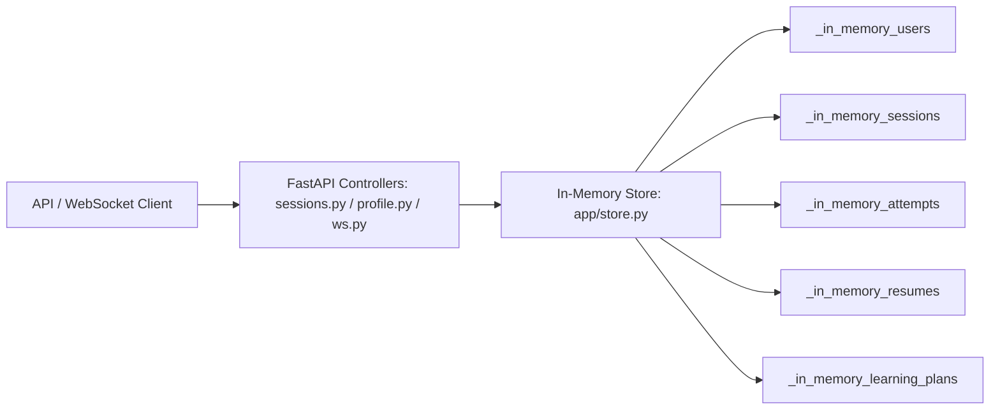

# 🤖 AI Technical Interview Coach

An enterprise-grade, full-stack, AI-powered mock interview simulator designed to conduct real-time, adaptive technical and behavioral interviews. Powered by an 8-agent **LangGraph** orchestration system, the platform parses candidate resumes, dynamically generates context-grounded interview questions, evaluates text and multimodal responses (audio/video), and produces granular performance analytics and personalized learning paths.

---

## 📋 Table of Contents

- [🤖 AI Technical Interview Coach](#-ai-technical-interview-coach)
  - [📋 Table of Contents](#-table-of-contents)
  - [🌟 Key System Capabilities](#-key-system-capabilities)
  - [🧠 AI \& Multi-Agent Architecture (LangGraph)](#-ai--multi-agent-architecture-langgraph)
    - [The 8 Specialized AI Agents](#the-8-specialized-ai-agents)
    - [LangGraph Workflow Diagram](#langgraph-workflow-diagram)
    - [State Management \& Dynamic Routing](#state-management--dynamic-routing)
  - [🧰 AI \& Media Technology Stack Breakdown](#-ai--media-technology-stack-breakdown)
    - [1. Multi-Agent Orchestration](#1-multi-agent-orchestration)
    - [2. Speech-to-Text (Audio-to-Text)](#2-speech-to-text-audio-to-text)
    - [3. Text-to-Speech (Text-to-Audio)](#3-text-to-speech-text-to-audio)
    - [4. Computer Vision \& Video Analytics](#4-computer-vision--video-analytics)
    - [5. Audio Analytics \& Speech Metrics Engine](#5-audio-analytics--speech-metrics-engine)
    - [6. Document Parsing \& Resume Intelligence](#6-document-parsing--resume-intelligence)
    - [7. LLM Provider Infrastructure](#7-llm-provider-infrastructure)
  - [⚡ Dual-Path Communication Architecture](#-dual-path-communication-architecture)
    - [Path 1: WebSockets (`/api/ws/{session_id}`)](#path-1-websockets-apiwssession_id)
    - [Path 2: REST Media Endpoint (`/api/sessions/{session_id}/media`)](#path-2-rest-media-endpoint-apisessionssession_idmedia)
  - [🛠️ Full-Stack Technology Stack](#️-full-stack-technology-stack)
    - [Frontend Stack](#frontend-stack)
    - [Backend Stack](#backend-stack)
  - [📂 Complete Repository Structure](#-complete-repository-structure)
  - [💾 In-Memory State Store & Data Models (`app/store.py`)](#-in-memory-state-store--data-models-appstorepy)
  - [⚙️ First-Time Installation \& Setup Guide](#️-first-time-installation--setup-guide)
    - [1. Prerequisites](#1-prerequisites)
    - [2. Clone the Repository](#2-clone-the-repository)
    - [3. Backend Setup](#3-backend-setup)
    - [4. Frontend Setup](#4-frontend-setup)
    - [5. Seed Demo Data](#5-seed-demo-data)
  - [▶️ Running the Application](#️-running-the-application)
    - [Terminal 1: FastAPI Backend](#terminal-1-fastapi-backend)
    - [Terminal 2: Vite Frontend](#terminal-2-vite-frontend)
  - [🔧 Environment Variables Reference](#-environment-variables-reference)
    - [Backend `.env`](#backend-env)
    - [Frontend `.env`](#frontend-env)
  - [🧪 Testing Suite](#-testing-suite)
    - [Backend Tests (Pytest)](#backend-tests-pytest)
    - [Frontend Tests (Vitest)](#frontend-tests-vitest)
  - [📐 Key Architecture Decisions (ADR Summary)](#-key-architecture-decisions-adr-summary)
  - [💡 Troubleshooting Guide](#-troubleshooting-guide)

---

## 🌟 Key System Capabilities

### 📄 1. Zero-Generic Resume Grounding
- **PDF & DOCX Parsing**: Automatically extracts candidate skills, project details, work experiences, and tech stacks during session initialization.
- **Strict Grounding Enforcement**: Prompts enforce that every interview question directly references items found on the candidate's resume (projects, tools, algorithms, or field-specific subtopics). No generic "tell me about yourself" filler questions.

### 🧠 2. Adaptive Multi-Agent State Machine
- **Dynamic Difficulty Adjustment**: Question complexity scales automatically based on real-time scoring of previous answers.
- **Intelligent Probing**: Triggers a dedicated **Follow-up Agent** whenever a candidate scores below **65/100** or completes a project-based question, testing deep technical mastery rather than surface memorization.
- **Diverse Question Framing**: Cycles through 6 distinct question angles: *Concept Definition*, *Applied Experience*, *Comparison & Trade-offs*, *Problem Solving*, *Deep Mechanism*, and *Limitation / Edge Cases*.

### 🎙️ 3. Real-Time Multimodal Evaluation (Audio & Video)
- **Automatic Speech Recognition (ASR)**: Uses OpenAI Whisper to transcribe spoken responses into text.
- **Neural Voice Synthesis (TTS)**: Leverages Edge-TTS with multi-persona voice assignments to speak questions aloud with natural inflection.
- **Audio Prosody & Communication Metrics**: Calculates Words Per Minute (WPM) speech pace, counts filler words (`um`, `uh`, `like`, `you know`, `basically`, `actually`, `so`), and grades communication clarity & confidence.
- **Computer Vision (OpenCV + MediaPipe)**: Samples camera video frames to compute face detection ratio, eye-contact proxy tracking, posture jitter stability, and overall visual engagement.

### 📊 4. Interactive Analytics & Custom Learning Paths
- **Live WebSocket Feedback Loop**: Instant server-to-client push of turn evaluation, raw score, reasoning, filler word breakdown, and reference model answer.
- **Post-Interview Session Report**: Comprehensive report with technical vs. communication score radar, attempt breakdown, and video engagement scores.
- **Automated Learning Plan**: Generates targeted study resources and external links focused specifically on weak areas identified during the session.

---

## 🧠 AI & Multi-Agent Architecture (LangGraph)

The platform's decision-making core is constructed with **LangGraph (`StateGraph`)** coupled with an in-memory `MemorySaver` checkpointer and an in-process state cache (`_session_states`).

### The 8 Specialized AI Agents

| Agent Name | Source File | Core Responsibility & Functionality |
| :--- | :--- | :--- |
| **Interview Orchestrator** | `backend/app/agents/orchestrator.py` | State machine supervisor. Evaluates conversation history, user scores, and target role to dynamically pick the next agent node (`technical`, `followup`, `scenario`, `personality`, or `learning`). |
| **Technical Specialist** | `backend/app/agents/technical_agent.py` | Generates role-specific technical questions based on resume skills and subtopics. Adjusts difficulty dynamically based on historical answer scores. |
| **Follow-up Agent** | `backend/app/agents/followup_agent.py` | Automatically activated when answer score `< 65/100`. Probes deeper into weak candidate responses to evaluate root-level comprehension. |
| **Scenario Agent** | `backend/app/agents/scenario_agent.py` | Issues real-world system design, architecture trade-off, and practical problem-solving scenarios tailored to resume tech stacks. |
| **Personality / HR Agent** | `backend/app/agents/personality_agent.py` | Evaluates behavioral fit, soft skills, communication clarity, and situational responses. |
| **Resume Parser Agent** | `backend/app/agents/resume_agent.py` | Runs at session startup. Analyzes raw resume text to structure candidate skills, subtopic maps, project details, and experience summaries. |
| **Learning Agent** | `backend/app/agents/learning_agent.py` | Executed upon interview completion (10 questions max). Aggregates scores, extracts weak areas, and builds a customized learning plan with study links. |
| **Audio Analysis Agent** | `backend/app/agents/audio_analysis_agent.py` | Operates asynchronously off the conversational hot-path to process audio metrics (pace WPM, filler word count, clarity score, confidence score). |
| **Video Analysis Agent** | `backend/app/agents/video_analysis_agent.py` | Operates asynchronously off the conversational hot-path to compute visual metrics (face detection, eye-contact estimation, posture jitter, engagement score). |

> [!NOTE]
> All 8 agents are registered in `AGENT_REGISTRY` (`backend/app/agents/graph.py`) per the system design specification.

### LangGraph Workflow Diagram

```mermaid
graph TD
    A[Upload Resume / Start Session] --> B[Resume Agent: Extract Skills & Projects]
    B --> C[Orchestrator Agent: Plan Next Turn]
    
    C -->|Route: Technical| D[Technical Agent: Tailored Qs]
    C -->|Route: Score < 65| E[Follow-up Agent: Deep Probe]
    C -->|Route: System Design| F[Scenario Agent: Architecture Scenario]
    C -->|Route: Behavioral| G[Personality / HR Agent: Soft Skills]
    C -->|Route: Target Qs (10) Reached| H[Learning Agent: Final Report & Study Plan]
    
    D & E & F & G --> I[Candidate Response Submission]
    
    I -->|Text Response| J[LLM Answer Evaluator: Score & Reasoning]
    I -->|Audio Upload| K[Audio Analysis Agent: Whisper STT, WPM, Filler Words]
    I -->|Video Upload| L[Video Analysis Agent: MediaPipe CV, Posture, Eye Contact]
    
    K & L --> J
    J --> C
    H --> M[Interview Completed / Report Generated]
```

### State Management & Dynamic Routing

Session state (`InterviewState`) is initialized with a randomized question sequence plan (e.g. 5 concept questions, 2 project questions, 2 scenario questions, plus dynamic follow-ups). State mutations are managed through:
- `init_session()`: Parses resume context and seeds state.
- `get_next_question()`: Invokes orchestrator planner → executes chosen specialist agent → updates checkpoint.
- `submit_answer()`: Evaluates answer against LLM rubrics, updates conversation history, tracks weak areas if score `< 65`, and returns detailed scoring data.
- `complete_session()`: Invokes `LearningAgent` to generate final analytics and resources.

---

## 🧰 AI & Media Technology Stack Breakdown

This section details every library, tool, model, and framework utilized across the AI and media processing pipeline:

```
                  +-------------------------------------------------------+
                  |               AI & MEDIA TECH STACK                   |
                  +-------------------------------------------------------+
                                              |
     +-------------------+--------------------+-------------------+-------------------+
     |                   |                    |                   |                   |
     v                   v                    v                   v                   v
[LangGraph]        [OpenAI Whisper]       [Edge-TTS]       [MediaPipe & OpenCV]   [PyPDF2 & Docx]
Orchestration      Speech-to-Text         Text-to-Speech    Computer Vision        Resume Parsing
(Graph State)      (model: whisper-1)     (Neural Voices)   (Face & Posture CV)    (Skill Extraction)
```

### 1. Multi-Agent Orchestration
- **Library**: `langgraph>=0.0.26`, `langchain-core>=0.1.0`, `langchain-openai>=0.0.5`
- **Role**: Manages multi-agent workflow state, edge routing, checkpointer persistence (`MemorySaver`), and agent turn execution.

### 2. Speech-to-Text (Audio-to-Text)
- **Library**: `openai>=1.12.0` (`AsyncOpenAI` client)
- **Model**: `whisper-1` via `client.audio.transcriptions.create`
- **Role**: Converts candidate audio recordings (`.webm`, `.mp3`, `.wav`) into exact text transcripts.
- **Customization**: Uses prompt hints (`"Um, uh, er, like, you know..."`) to ensure Whisper does not strip filler words during transcription, keeping speech analysis accurate.

### 3. Text-to-Speech (Text-to-Audio)
- **Library**: `edge-tts>=7.0.0` (`edge_tts.Communicate`)
- **Role**: Converts AI-generated interview question text into high-quality, neural audio clips saved under `backend/media/tts/`.
- **Persona Voice Mapping**:
  - **HR / Behavioral / Intro**: `en-US-JennyNeural` (Warm, professional female tone)
  - **Technical / Coding / Follow-up**: `en-US-ChristopherNeural` (Clear, authoritative male technical tone)
  - **Scenario / System Design**: `en-US-EricNeural` (Deep, analytical male architect tone)
- **Speech Sanitizer**: `sanitize_text_for_speech()` removes markdown formatting, code blocks, difficulty tags like `[medium]`, and metadata annotations before feeding text to TTS.

### 4. Computer Vision & Video Analytics
- **Libraries**: `opencv-python-headless>=4.9.0` (`cv2`), `mediapipe>=0.10.9` (`mediapipe.solutions.face_detection`)
- **Role**: Performs non-invasive visual analysis of candidate video submissions.
- **Metrics Calculated**:
  - **Face Detection Ratio**: Percentage of video frames where candidate's face is detected.
  - **Eye Contact Estimation**: Derived ratio tracking centered face presence (`face_ratio * 0.9`).
  - **Posture Stability**: Calculated by tracking frame-by-frame center coordinate jitter of the face bounding box (`1.0 - jitter * 5`).
  - **Engagement Score**: Weighted formula: `(Face Ratio * 40) + (Eye Contact * 30) + (Posture Stability * 30)`.

### 5. Audio Analytics & Speech Metrics Engine
- **Module**: `backend/app/services/transcription_service.py` (`AudioAnalysisService`)
- **Role**: Evaluates verbal communication skills:
  - **Pace (WPM)**: Words Per Minute computed over response duration.
  - **Filler Word Detection**: Matches spoken tokens against predefined filler vocabulary: `{"um", "uh", "like", "you know", "basically", "actually", "so"}`.
  - **Clarity & Confidence Scores**: Derived scores based on filler ratio and pace deviation from normal conversational speaking speeds (120-160 WPM).

### 6. Document Parsing & Resume Intelligence
- **Libraries**: `PyPDF2>=3.0.0` (`PdfReader`), `python-docx>=1.1.0` (`Document`)
- **Module**: `backend/app/services/resume_parser.py`
- **Role**: Extracts raw text from `.pdf` and `.docx` uploads. Matches text against 50+ predefined tech stack keywords (Python, React, Docker, Kubernetes, PyTorch, AWS, etc.) and populates subtopic knowledge graphs (`SKILL_SUBTOPICS_PREDEFINED`).

### 7. LLM Provider Infrastructure
- **Module**: `backend/app/services/llm_provider.py`
- **Primary Model**: `OpenAI gpt-4o-mini` (temperature: 0.7 for questions, 0.2 for evaluation).
- **Fallback Provider**: `FakeLLMProvider` automatically activates when `OPENAI_API_KEY` is not configured or `ENVIRONMENT=test`, returning deterministic canned responses without external API calls.

---

## ⚡ Dual-Path Communication Architecture

To optimize responsiveness, the system splits communication into two distinct execution paths:

```
[Candidate Frontend]
        |
        +---> (WebSocket Path) ---> Live Text Q&A + Server Events + Evaluation Pushing
        |
        +---> (REST Media Path) --> Audio/Video Upload ---> Background Whisper/CV Processing
```

### Path 1: WebSockets (`/api/ws/{session_id}`)
- **Purpose**: Real-time interactive interviewing.
- **Protocol**: JSON over WebSockets (`ws://localhost:8000/api/ws/{session_id}?token=...`).
- **Flow**:
  1. Client sends `get_next_question` or `submit_answer`.
  2. Server processes request through `InterviewGraph`.
  3. Server pushes structured events: `question`, `evaluation`, `error`, `session_complete`.

### Path 2: REST Media Endpoint (`/api/sessions/{session_id}/media`)
- **Purpose**: Upload binary audio (`.webm`) or video (`.webm`/`.mp4`) responses.
- **Flow**:
  1. Client posts multipart form data with audio/video file and `attempt_id`.
  2. Server saves file to `backend/media/uploads/`.
  3. Server invokes `run_media_agents()` off the conversational hot-path (runs Whisper STT + MediaPipe CV).
  4. Server passes transcript to `InterviewGraph.submit_answer()`.
  5. Server broadcasts answer evaluation back over the WebSocket connection.

---

## 🛠️ Full-Stack Technology Stack

### Frontend Stack
- **Framework**: React 19 (`react` 19.2, `react-dom` 19.2)
- **Build Tool**: Vite 8 (`vite` 8.1)
- **Language**: TypeScript (`typescript` 6.0)
- **Styling**: Tailwind CSS v4 (`tailwindcss` 4.3)
- **State Management**: Zustand 5 (`zustand` 5.0) with local storage persistence (`authStore`, `interviewStore`)
- **Data Fetching & Caching**: TanStack React Query v5 (`@tanstack/react-query` 5.101)
- **Routing**: React Router v7 (`react-router-dom` 7.18)
- **Forms & Validation**: React Hook Form 7 (`react-hook-form` 7.81) + Zod (`zod` 4.4) + `@hookform/resolvers`
- **Charts & Data Visualization**: Recharts 3 (`recharts` 3.9)
- **HTTP Client**: Axios 1 (`axios` 1.18) with auto JWT refresh interceptor
- **Testing & Tooling**: Vitest (`vitest` 4.1), Testing Library, MSW (`msw` 2.15), Oxlint (`oxlint` 1.71)

### Backend Stack
- **Web Framework**: FastAPI 0.109+ (`fastapi`, `uvicorn[standard]`)
- **Language**: Python 3.11
- **State & Data Store**: In-Memory Transient Store (`app/store.py`) with zero external database setup required (`_in_memory_users`, `_in_memory_sessions`, `_in_memory_attempts`, `_in_memory_resumes`, `_in_memory_learning_plans`)
- **Data Schemas**: Pydantic v2 (`pydantic`, `pydantic-settings`)
- **Security & Auth**: SHA-256 (Token hashing), Mock auth bypass dependency (`deps.py`)
- **Testing**: Pytest 7.4+ (`pytest`, `pytest-asyncio`, `pytest-cov`)

---

## 📂 Complete Repository Structure

```
Interview_Coach/
├── backend/                        # FastAPI Python Backend Service
│   ├── app/
│   │   ├── agents/                 # 8 LangGraph AI Agents & Graph Definition
│   │   │   ├── audio_analysis_agent.py   # Audio metrics calculation agent
│   │   │   ├── followup_agent.py         # Dynamic probing agent (score < 65)
│   │   │   ├── graph.py                  # LangGraph StateGraph & workflow compiler
│   │   │   ├── learning_agent.py         # Final analytics & study path agent
│   │   │   ├── orchestrator.py           # Multi-agent state machine supervisor
│   │   │   ├── personality_agent.py      # Behavioral & HR specialist agent
│   │   │   ├── resume_agent.py           # Resume skill & project extractor node
│   │   │   ├── resume_context.py         # Context sufficiency validator
│   │   │   ├── scenario_agent.py         # System design & architecture scenario agent
│   │   │   ├── state.py                  # TypedDict state interface
│   │   │   ├── technical_agent.py        # Resume-grounded technical Q agent
│   │   │   └── video_analysis_agent.py   # MediaPipe computer vision agent
│   │   ├── api/                    # REST Controllers & WebSocket Handlers
│   │   │   ├── attempts.py               # Attempt logging endpoints
│   │   │   ├── deps.py                   # Dependency injection (Auth, DB)
│   │   │   ├── health.py                 # Health check endpoint (/api/health)
│   │   │   ├── media.py                  # Audio/video file upload controller
│   │   │   ├── profile.py                # Candidate resume & target role endpoints
│   │   │   ├── sessions.py               # Session CRUD & REST submit fallback
│   │   │   ├── users.py                  # User profile management endpoints
│   │   │   └── ws.py                     # WebSocket real-time interview handler
│   │   ├── core/                   # Infrastructure & Middleware
│   │   │   ├── exceptions.py             # Global exception handlers & error schemas
│   │   │   └── logging_config.py         # Structured logging configuration
│   │   ├── models/                 # SQLAlchemy Async Database Models
│   │   │   └── __init__.py               # User, Session, Question, Attempt models
│   │   ├── schemas/                # Pydantic Request/Response DTOs
│   │   │   └── __init__.py               # Pydantic schemas for auth, sessions, etc.
│   │   ├── services/               # AI Engine & External Integrations
│   │   │   ├── llm_provider.py           # OpenAI API client & FakeLLMProvider
│   │   │   ├── resume_parser.py          # PyPDF2 & docx text extraction & regex matcher
│   │   │   ├── storage_service.py        # Local file storage manager
│   │   │   ├── transcription_service.py  # Whisper STT & Audio Analysis Engine
│   │   │   ├── tts_service.py            # Edge-TTS neural speech generator
│   │   │   └── video_analysis_service.py # OpenCV & MediaPipe computer vision engine
│   │   ├── utils/                  # Utility Functions
│   │   │   └── question_text.py          # Question text formatting helpers
│   │   ├── config.py               # Application Pydantic settings
│   │   ├── main.py                 # FastAPI application factory & CORS setup
│   │   ├── seed.py                 # Database Seeding script (demo@example.com)
│   │   └── store.py                # Session state helper store
│   ├── media/                      # Storage directory for uploads & TTS audio files
│   ├── tests/                      # Pytest Test Suite
│   │   ├── test_agents/              # Agent graph & routing unit tests
│   │   ├── test_health.py            # Health check tests
│   │   ├── test_profile.py           # Profile & resume upload tests
│   │   ├── test_sessions.py          # Interview session lifecycle tests
│   │   └── test_users.py             # Auth & user management tests
│   ├── .env.example                # Template backend configuration
│   ├── pytest.ini                  # Pytest configuration
│   └── requirements.txt            # Python dependencies
├── frontend/                       # React TypeScript Frontend (Vite)
│   ├── src/
│   │   ├── api/                    # Axios Client & API Endpoints
│   │   │   ├── auth.ts                   # Login / Signup API calls
│   │   │   ├── client.ts                 # Axios instance with 401 token refresh logic
│   │   │   ├── profile.ts                # Profile & resume upload API calls
│   │   │   ├── sessions.ts               # Session CRUD API calls
│   │   │   └── types.ts                  # TypeScript API contracts
│   │   ├── components/             # UI Components
│   │   │   ├── interview/                # Interview Console sub-components
│   │   │   │   ├── AudioAnswerPanel.tsx      # Audio recording UI panel
│   │   │   │   ├── AudioOnlyPanel.tsx        # Speech-driven voice interview UI
│   │   │   │   ├── ConnectionStatusBadge.tsx # WebSocket status indicator
│   │   │   │   ├── ConversationTimeline.tsx  # Interactive turn-by-turn chat history
│   │   │   │   ├── InterviewerPersona.tsx    # Animated AI interviewer avatar + TTS player
│   │   │   │   ├── StageProgress.tsx         # Interview question step progress bar
│   │   │   │   ├── VideoAnswerPanel.tsx      # Webcam recording & camera preview panel
│   │   │   │   └── VoiceInterviewPanel.tsx   # Voice & transcript control panel
│   │   │   └── layout/                   # Layout wrappers
│   │   │       ├── AppLayout.tsx             # Primary app navbar & sidebar layout
│   │   │       ├── AuthBootstrap.tsx         # Auth state initialization wrapper
│   │   │       └── ProtectedRoute.tsx        # Auth route guard
│   │   ├── config/                 # Application Configuration
│   │   │   └── auth.ts                   # Storage key constants
│   │   ├── hooks/                  # Custom React Hooks
│   │   │   ├── useAudioRecorder.ts       # Web Audio API MediaRecorder hook
│   │   │   ├── useAutoAudioRecorder.ts   # Hands-free VAD speech recording hook
│   │   │   ├── useInterviewSocket.ts     # Real-time WebSocket connection manager
│   │   │   ├── useInterviewTimer.ts      # Turn & session timer hook
│   │   │   ├── useSpeechRecognition.ts   # Web Speech API ASR hook
│   │   │   ├── useSpeechSynthesis.ts     # Web Speech API TTS hook
│   │   │   └── useVideoRecorder.ts       # MediaDevices webcam video recorder hook
│   │   ├── pages/                  # Page Views
│   │   │   ├── DashboardPage.tsx         # Candidate dashboard & past sessions
│   │   │   ├── InterviewConsolePage.tsx  # Core live interview interface
│   │   │   ├── LandingPage.tsx           # Product homepage & features
│   │   │   ├── LoginPage.tsx             # Authentication login screen
│   │   │   ├── SessionReportPage.tsx     # Post-interview detailed report & analytics
│   │   │   └── SignupPage.tsx            # New candidate registration screen
│   │   ├── store/                  # Global State (Zustand)
│   │   │   ├── authStore.ts              # Authentication & user state
│   │   │   └── interviewStore.ts         # Live interview active session state
│   │   ├── utils/                  # Helper Utilities
│   │   │   ├── interviewScript.ts        # Script formatter
│   │   │   └── speechText.ts             # Speech text processing helpers
│   │   ├── App.css / index.css     # Global styles & Tailwind directives
│   │   ├── App.tsx                 # App routes & router provider
│   │   └── main.tsx                # Entry point
│   ├── .env.example                # Template frontend configuration
│   ├── index.html                  # HTML document template
│   ├── package.json                # Node dependencies & npm scripts
│   ├── tsconfig.json               # TypeScript configuration
│   └── vite.config.ts              # Vite configuration & server proxy setup
├── DECISIONS.md                    # Architectural Decision Records (ADRs)
└── README.md                       # Unified master project documentation
```

---

## 💾 In-Memory State Store & Data Models (`app/store.py`)

The backend operates on a high-performance **In-Memory Transient State Store** (`backend/app/store.py`), requiring **zero database installation, zero configuration, and zero migrations**. All interview sessions, user profiles, attempts, and learning plans are managed through fast in-memory dictionaries:

| Memory Store Dict | Data Entity Model | Description |
| :--- | :--- | :--- |
| `_in_memory_users` | `MockUser` | Stores active user identity (pre-seeded with `demo@example.com` / `DEMO_USER_ID`) |
| `_in_memory_sessions` | `InMemoryModel` | Stores active and completed interview sessions, target roles, scores, and status |
| `_in_memory_attempts` | `InMemoryModel` | Stores question attempts, candidate answers, score breakdowns, WPM, and CV metrics |
| `_in_memory_resumes` | `dict` | Caches parsed resume skills, subtopic mappings, project stacks, and raw text |
| `_in_memory_learning_plans` | `InMemoryModel` | Caches generated post-interview learning plans and resource recommendations |



---

## ⚙️ First-Time Installation & Setup Guide

### 1. Prerequisites
- **Python**: `3.11` (Anaconda or `venv` recommended)
- **Node.js**: `18.x` or newer (with `npm` 9+)
- **Git**: Installed on your path

### 2. Clone the Repository
```bash
git clone https://github.com/ShubhamPandey020525/Interview_Coach.git
cd Interview_Coach
```

### 3. Backend Setup

```bash
# 1. Navigate to backend directory
cd backend

# 2. Create Conda environment (Python 3.11)
conda create -n ai-interview python=3.11 -y

# 3. Activate the environment
conda activate ai-interview

# 4. Install Python dependencies
pip install -r requirements.txt

# 5. Create local environment configuration
# On Windows:
copy .env.example .env
# On macOS / Linux:
cp .env.example .env

# 6. Generate a secure secret key for JWT signing
python -c "import secrets; print(secrets.token_urlsafe(32))"
```

> [!IMPORTANT]
> Copy the output string generated by step 6 and set it as `SECRET_KEY` inside `backend/.env`. If you have an OpenAI API key, set `OPENAI_API_KEY=sk-...`. If left empty, the application automatically uses `FakeLLMProvider` for all operations.

### 4. Frontend Setup

In a new terminal window:

```bash
# 1. Navigate into frontend directory
cd frontend

# 2. Install Node dependencies
npm install

# 3. Create local environment configuration
# On Windows:
copy .env.example .env
# On macOS / Linux:
cp .env.example .env
```

### 5. Seed Demo Data

With the backend environment activated, populate the database with a pre-configured demo user and completed session:

```bash
cd backend
conda activate ai-interview
python -m app.seed
```

- **Demo Credentials**:
  - **Email**: `demo@example.com`
  - **Password**: `demo12345`

---

## ▶️ Running the Application

Launch both servers simultaneously in separate terminal windows:

### Terminal 1: FastAPI Backend
```bash
cd backend
conda activate ai-interview
uvicorn app.main:app --reload --host 0.0.0.0 --port 8000
```
- **Swagger Interactive API Documentation**: [http://localhost:8000/docs](http://localhost:8000/docs)
- **ReDoc API Documentation**: [http://localhost:8000/redoc](http://localhost:8000/redoc)
- **API Health Endpoint**: [http://localhost:8000/api/health](http://localhost:8000/api/health)

### Terminal 2: Vite Frontend
```bash
cd frontend
npm run dev
```
- **Application URL**: [http://localhost:5173](http://localhost:5173) (or `http://localhost:5174` if port 5173 is in use)

---

## 🔧 Environment Variables Reference

### Backend `.env`

| Key | Default Value | Description |
| :--- | :--- | :--- |
| `PROJECT_NAME` | `AI Technical Interview Coach` | Application title |
| `ENVIRONMENT` | `development` | Deployment mode (`development`, `production`, `test`) |
| `SECRET_KEY` | *Generated Secret* | Secret key for JWT access token signing |
| `ALGORITHM` | `HS256` | JWT signing algorithm |
| `ACCESS_TOKEN_EXPIRE_MINUTES` | `30` | Access token lifetime in minutes |
| `REFRESH_TOKEN_EXPIRE_DAYS` | `7` | Refresh token lifetime in days |
| `DATABASE_URL` | `sqlite+aiosqlite:///./app.db` | Async SQLAlchemy database connection string |
| `OPENAI_API_KEY` | `""` | OpenAI API key. Fallbacks to `FakeLLMProvider` if blank |
| `MEDIA_ROOT` | `./media` | Local storage directory for uploads & TTS audio files |
| `CORS_ORIGINS` | `["http://localhost:5173", ...]` | Allowed CORS origin URLs (JSON array string) |

### Frontend `.env`

| Key | Default Value | Description |
| :--- | :--- | :--- |
| `VITE_API_BASE_URL` | `http://localhost:8000` | Backend REST API endpoint URL |
| `VITE_WS_BASE_URL` | `ws://localhost:8000` | Backend WebSocket endpoint URL |
| `VITE_SKIP_AUTH` | `false` | Development flag to bypass login with automatic demo credentials |

---

## 🧪 Testing Suite

### Backend Tests (Pytest)
Run the automated test suite covering multi-agent graph routing, authentication middleware, resume parsing, and API endpoints:

```bash
cd backend
conda activate ai-interview

# Run all tests
pytest

# Run tests with HTML coverage report
pytest --cov=app --cov-report=html
```

> [!NOTE]
> All LLM calls and external media services are automatically mocked during pytest execution (`ENVIRONMENT=test`). No external network connection or API credits are required.

### Frontend Tests (Vitest)
Run component unit tests and UI state assertions:

```bash
cd frontend

# Run tests in single-pass mode
npm test

# Run tests with UI watcher
npx vitest
```

---

## 📐 Key Architecture Decisions (ADR Summary)

Below is a summary of the technical design decisions documented in `DECISIONS.md`:

1. **8 Specialized Agents via LangGraph**: All eight required system agents are built as modular Python nodes under `backend/app/agents/`. `graph.py` links them using conditional edge routing managed by the Orchestrator.
2. **SHA-256 Refresh Token Hashing**: Refresh tokens are stored using deterministic SHA-256 hashes (`hashlib.sha256`) rather than bcrypt to allow fast database index lookups.
3. **Off-Hot-Path Media Processing**: Speech-to-Text (Whisper) and Video Computer Vision (MediaPipe) run asynchronously off the main conversational path to guarantee non-blocking turn transitions.
4. **Graceful Computer Vision Fallbacks**: If MediaPipe or OpenCV are missing or fail on a system, the video analysis service falls back to nominal posture/engagement scores without crashing the interview.
5. **Edge-TTS Neural Audio Generation**: Implemented Microsoft Edge-TTS for question audio playback, featuring persona-specific voice mapping (Jenny, Christopher, Eric) and automatic markdown text sanitization.
6. **Dual WebSocket + REST Interoperability**: Primary interview interactions run over WebSockets; REST endpoints serve as fallback mechanisms for text submissions and file upload handling.

---

## 💡 Troubleshooting Guide

| Issue / Error | Root Cause | Solution / Fix |
| :--- | :--- | :--- |
| **`OPTIONS 400` or CORS Error** | Vite dev server running on non-default port (e.g. `5174` instead of `5173`). | Add `http://localhost:5174` to `CORS_ORIGINS` list in `backend/.env`. |
| **Backend Unreachable Banner** | FastAPI backend server is not running on port 8000. | Ensure `uvicorn app.main:app --reload` is running in Terminal 1. |
| **WebSocket Connection Closed** | Auth token expired or session state invalidated. | Clear browser `localStorage` (`auth-storage` key) and log in again with `demo@example.com`. |
| **MediaPipe / Camera Error** | Web browser blocked webcam/microphone permissions. | Grant browser site permissions for camera and microphone in browser URL settings. |
| **`ENOENT package.json` in root** | Attempted to run `npm` commands from project root directory. | Always `cd frontend` before executing `npm` commands. |

---

<p align="center">
  Built with ❤️ by the AI Interview Coach Team
</p>
