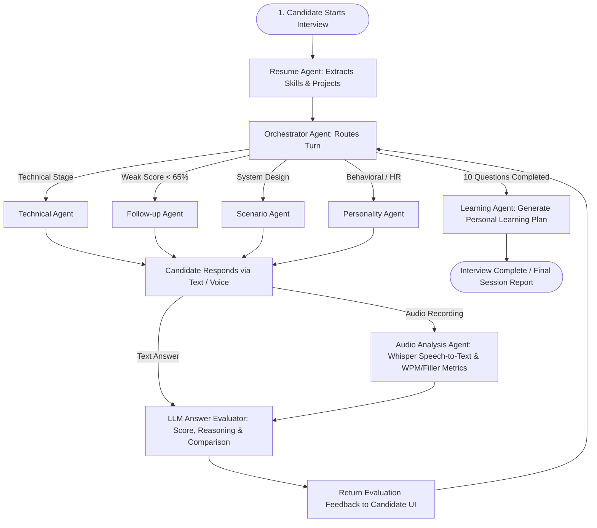

# 🤖 AI Technical Interview Coach

An AI-powered mock interview system built with **FastAPI**, **React**, and **LangGraph**. The platform uses a multi-agent AI framework to parse candidate resumes, generate role-tailored technical and behavioral questions, evaluate spoken or typed answers, and deliver personalized learning plans.

---

## 🌟 Overview

The AI Technical Interview Coach simulates real-world job interviews. Instead of generic questions, the system reads your resume skills and projects to ask grounded, relevant questions. It adapts question difficulty based on your performance, probes deeper when an answer is weak, and provides detailed feedback including score, model answer, speech pace, and filler word breakdown.

---

## 🤖 The 8 AI Agents and Their Roles

The core engine is powered by **LangGraph** with 8 specialized AI agents working together:

| # | Agent Name | File | Role & Responsibility |
|---|---|---|---|
| **1** | **Orchestrator Agent** | [`orchestrator.py`](file:///c:/Users/pande/Interview_Coach/backend/app/agents/orchestrator.py) | **Interview Supervisor & Planner**. Manages state transitions, tracks question limits, and decides which agent should handle the next turn (e.g. Technical, Follow-up, Scenario, or Learning). |
| **2** | **Resume Agent** | [`resume_agent.py`](file:///c:/Users/pande/Interview_Coach/backend/app/agents/resume_agent.py) | **Context Initializer**. Parses PDF/DOCX resumes at session startup, extracting candidate skills, tech stack keywords, and project details so all questions stay grounded in candidate experience. |
| **3** | **Technical Agent** | [`technical_agent.py`](file:///c:/Users/pande/Interview_Coach/backend/app/agents/technical_agent.py) | **Technical Examiner**. Generates role-specific coding, system design, and computer science questions matched to the candidate's target role and resume skills. |
| **4** | **Follow-up Agent** | [`followup_agent.py`](file:///c:/Users/pande/Interview_Coach/backend/app/agents/followup_agent.py) | **Deep Probe Specialist**. Automatically triggered when a candidate's answer score is below 65% or incomplete. Probes deeper into weak technical areas to test true comprehension. |
| **5** | **Scenario Agent** | [`scenario_agent.py`](file:///c:/Users/pande/Interview_Coach/backend/app/agents/scenario_agent.py) | **System Architecture & Situational Specialist**. Asks open-ended production trade-off, architectural design, and practical problem-solving scenarios based on the resume tech stack. |
| **6** | **Personality Agent** | [`personality_agent.py`](file:///c:/Users/pande/Interview_Coach/backend/app/agents/personality_agent.py) | **Behavioral & HR Specialist**. Asks questions about past project challenges, team collaboration, leadership experience, and soft skills. |
| **7** | **Learning Agent** | [`learning_agent.py`](file:///c:/Users/pande/Interview_Coach/backend/app/agents/learning_agent.py) | **Post-Interview Coach**. Runs when the interview completes (max questions reached). Synthesizes candidate scores and resume skill gaps to generate a personalized learning plan. |
| **8** | **Audio Analysis Agent** | [`audio_analysis_agent.py`](file:///c:/Users/pande/Interview_Coach/backend/app/agents/audio_analysis_agent.py) | **Voice & Speech Analyst**. Processes recorded candidate voice responses off the main thread. Measures Speech Pace (WPM), counts filler words (`um`, `uh`, `like`), and computes clarity/confidence scores. |

---

## 🔄 How the Multi-Agent System Works


```mermaid
flowchart TD
    Start([1. Candidate Starts Interview]) --> Resume[Resume Agent: Extracts Skills & Projects]
    Resume --> Orch[Orchestrator Agent: Routes Turn]
    
    Orch -->|Technical Stage| Tech[Technical Agent]
    Orch -->|Weak Score < 65%| Followup[Follow-up Agent]
    Orch -->|System Design| Scenario[Scenario Agent]
    Orch -->|Behavioral / HR| Personality[Personality Agent]
    
    Tech & Followup & Scenario & Personality --> CandidateAnswer[Candidate Responds via Text / Voice]
    
    CandidateAnswer -->|Audio Recording| AudioAgent[Audio Analysis Agent: Whisper Speech-to-Text & WPM/Filler Metrics]
    CandidateAnswer -->|Text Answer| LLMEval[LLM Answer Evaluator: Score, Reasoning & Comparison]
    
    AudioAgent --> LLMEval
    LLMEval --> PushResult[Return Evaluation Feedback to Candidate UI]
    PushResult --> Orch
    
    Orch -->|10 Questions Completed| Learning[Learning Agent: Generate Personal Learning Plan]
    Learning --> Complete([Interview Complete / Final Session Report])
```

---

## 🗣️ Voice Generation & Candidate Input Processing

### 1. Text-to-Speech Voice Generation (Edge-TTS)
Questions generated by AI are converted into high-quality human speech audio clips (`.mp3`) using Microsoft Edge-TTS Neural Voice models:
- **`en-US-JennyNeural`**: Used for HR, Behavioral, Personality, and Intro stages.
- **`en-US-ChristopherNeural`**: Used for Technical, Coding, and Follow-up stages.
- **`en-US-EricNeural`**: Used for System Design and Scenario stages.
- **Fallback Engine**: `gTTS` (Google Text-to-Speech) automatically activates if Edge-TTS network requests fail.

---

### 2. Candidate Input Processing (Text & Speech-to-Text)

Candidates can respond using either **typed text** or **spoken voice**:

- **⌨️ Typed Text Input**:
  - Candidate types their response directly into the console.
  - The answer string is sent to the backend and evaluated by the LLM against scoring rubrics (Score 0-100, Reasoning, Model Answer, Comparison).

- **🎙️ Spoken Audio Input (Speech-to-Text via Whisper)**:
  - Candidate speaks their response into the microphone, recorded as a `.webm` audio file.
  - **Whisper Speech-to-Text (STT)** (`faster-whisper`) transcribes the spoken audio into an exact text transcript.
  - **Audio Analytics Engine** computes Speech Pace in Words Per Minute (WPM) and detects filler words (`um`, `uh`, `like`, `you know`, `basically`).
  - The transcribed text is sent to the LLM for technical evaluation, and combined scores (technical accuracy + speech clarity + filler word ratio) are returned to the candidate interface.

---

## 🎓 Learning Agent & Report Flow

Once 10 questions are completed, the Orchestrator marks the interview complete and triggers the **Learning Agent**:

- **Personalized Plan Generation**: The Learning Agent passes the candidate's target role, resume skills, session scores, and weak area history to the LLM to identify exact technical knowledge gaps.
- **Structured Recommendations**: The AI synthesizes targeted study topics and recommended external links (documentation, guides, articles) specifically tailored to gaps identified during the interview.
- **Dashboard Integration**: The generated learning plan is saved in session state and displayed on the candidate's **Session Report Page**, giving candidate-specific actionable steps to improve before real job interviews.

---

## 🛠️ Technology Stack

- **Backend**: Python 3.11, FastAPI, LangGraph, OpenAI / Gemini LLM API, Faster-Whisper (STT), Edge-TTS (TTS), OpenCV & MediaPipe (Computer Vision).
- **Frontend**: React 19, Vite, TypeScript, Tailwind CSS v4, Zustand (State Management), TanStack React Query, Recharts (Analytics Charts).
- **Data & Storage**: In-Memory Transient Store (`app/store.py`), zero database installation required.

---

## 🚀 Quick Start Guide

### Prerequisites
- Python 3.11
- Node.js 18+

### 1. Setup & Run Backend

```bash
cd backend

# Create & activate environment
conda create -n ai-interview python=3.11 -y
conda activate ai-interview

# Install dependencies
pip install -r requirements.txt

# Create .env file
cp .env.example .env

# Run FastAPI Server
uvicorn app.main:app --reload --host 0.0.0.0 --port 8000
```

FastAPI Server runs at: `http://localhost:8000` (API Docs at `http://localhost:8000/docs`).

### 2. Setup & Run Frontend

In a new terminal window:

```bash
cd frontend

# Install dependencies
npm install

# Create .env file
cp .env.example .env

# Run Vite Dev Server
npm run dev
```

Frontend Application runs at: `http://localhost:5173`.

---

## 🧪 Testing

Run backend tests:
```bash
cd backend
conda activate ai-interview
pytest
```
