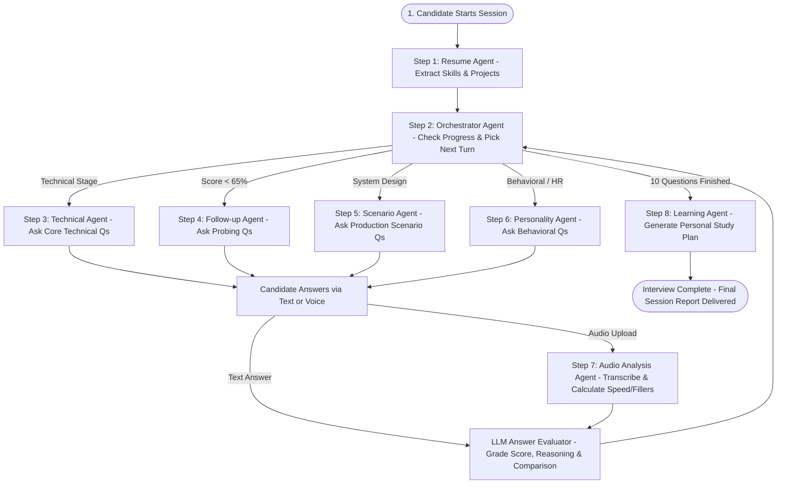

# 🤖 AI Technical Interview Coach

An AI-powered mock interview system built with **FastAPI**, **React**, and **LangGraph**. The platform uses 8 AI agents to read candidate resumes, ask role-specific technical and behavioral questions, grade typed or spoken answers, and create personalized learning plans.

---

## 🌟 Overview

The AI Technical Interview Coach creates realistic mock interviews. Instead of asking random questions, it reads your resume to ask questions about your actual skills and projects. It adjusts question difficulty based on your answers, asks follow-up questions when an answer is weak, and gives detailed feedback on your score, speech speed, and filler words.

---

## 🤖 The 8 AI Agents and Their Roles

The system uses **LangGraph** to coordinate 8 AI agents:

| # | Agent Name | File | Type | Role & Description |
|---|---|---|---|---|
| **1** | **Orchestrator Agent** | [`orchestrator.py`](file:///c:/Users/pande/Interview_Coach/backend/app/agents/orchestrator.py) | Logic | **Interview Manager**. Tracks question counts and decides which agent asks the next question. |
| **2** | **Resume Agent** | [`resume_agent.py`](file:///c:/Users/pande/Interview_Coach/backend/app/agents/resume_agent.py) | LLM | **Resume Reader**. Parses PDF/DOCX resumes to extract skills and project details. |
| **3** | **Technical Agent** | [`technical_agent.py`](file:///c:/Users/pande/Interview_Coach/backend/app/agents/technical_agent.py) | LLM | **Technical Examiner**. Asks coding, system design, and technical questions based on your resume. |
| **4** | **Follow-up Agent** | [`followup_agent.py`](file:///c:/Users/pande/Interview_Coach/backend/app/agents/followup_agent.py) | LLM | **Deep Examiner**. Triggers when a score is under 65% to ask deeper questions on weak areas. |
| **5** | **Scenario Agent** | [`scenario_agent.py`](file:///c:/Users/pande/Interview_Coach/backend/app/agents/scenario_agent.py) | LLM | **System Architect**. Asks real-world production trade-off and system design questions. |
| **6** | **Personality Agent** | [`personality_agent.py`](file:///c:/Users/pande/Interview_Coach/backend/app/agents/personality_agent.py) | LLM | **Behavioral Examiner**. Asks soft skills, teamwork, and past project challenge questions. |
| **7** | **Learning Agent** | [`learning_agent.py`](file:///c:/Users/pande/Interview_Coach/backend/app/agents/learning_agent.py) | LLM | **Study Coach**. Analyzes weak areas at the end of the interview to build a custom study plan. |
| **8** | **Audio Analysis Agent** | [`audio_analysis_agent.py`](file:///c:/Users/pande/Interview_Coach/backend/app/agents/audio_analysis_agent.py) | Engine | **Voice Analyst**. Transcribes spoken answers, calculates speech speed (WPM), and counts filler words. |

---

### 🛠️ Helper Files

Besides the 8 main agents, the system relies on 4 helper files:

| File | Type | Description |
|---|---|---|
| [`graph.py`](file:///c:/Users/pande/Interview_Coach/backend/app/agents/graph.py) | Engine | **LangGraph Compiler**. Connects all agent nodes into an executable graph workflow. |
| [`state.py`](file:///c:/Users/pande/Interview_Coach/backend/app/agents/state.py) | Schema | **Shared State Data**. Defines the shared data structure (`InterviewState`) used by all agents. |
| [`resume_context.py`](file:///c:/Users/pande/Interview_Coach/backend/app/agents/resume_context.py) | Helper | **Resume Checker**. Checks if the candidate uploaded a valid resume before starting. |
| [`video_analysis_agent.py`](file:///c:/Users/pande/Interview_Coach/backend/app/agents/video_analysis_agent.py) | Helper | **Vision Evaluator**. Uses MediaPipe and OpenCV to measure posture stability and eye contact. |

---

## 🔄 Sequential Interview Workflow

Here is how a candidate moves through the agents during an interview session:


```mermaid
flowchart TD
    Start([1. Candidate Starts Session]) --> Resume[Step 1: Resume Agent - Extract Skills & Projects]
    Resume --> Orch[Step 2: Orchestrator Agent - Check Progress & Pick Next Turn]
    
    Orch -->|Technical Stage| Tech[Step 3: Technical Agent - Ask Core Technical Qs]
    Orch -->|Score < 65%| Followup[Step 4: Follow-up Agent - Ask Probing Qs]
    Orch -->|System Design| Scenario[Step 5: Scenario Agent - Ask Production Scenario Qs]
    Orch -->|Behavioral / HR| Personality[Step 6: Personality Agent - Ask Behavioral Qs]
    
    Tech & Followup & Scenario & Personality --> CandidateAnswer[Candidate Answers via Text or Voice]
    
    CandidateAnswer -->|Audio Upload| AudioAgent[Step 7: Audio Analysis Agent - Transcribe & Calculate Speed/Fillers]
    CandidateAnswer -->|Text Answer| LLMEval[LLM Answer Evaluator - Grade Score, Reasoning & Comparison]
    
    AudioAgent --> LLMEval
    LLMEval --> Orch
    
    Orch -->|10 Questions Finished| Learning[Step 8: Learning Agent - Generate Personal Study Plan]
    Learning --> Complete([Interview Complete - Final Session Report Delivered])
```

---

## ⚙️ How Each Agent Works

---

### 🟢 Non-LLM Agents (Built-in Python Logic & Local Models)

#### 1. Orchestrator Agent (`orchestrator.py`) — *State Logic*
- Uses Python logic to manage interview flow without calling an LLM.
- Checks question count and scores. If 10 questions are done, it sends the user to the **Learning Agent**. If the last score was below 65%, it sends the user to the **Follow-up Agent**.

#### 2. Audio Analysis Agent (`audio_analysis_agent.py`) — *Speech Processing*
- Runs off the main conversational thread using local tools (no LLM calls).
- Transcribes `.webm` voice recordings into text using local **OpenAI Whisper STT** (`faster-whisper`).
- Calculates speech speed in Words Per Minute (WPM) and counts filler words like `um`, `uh`, `like`, `you know`, and `basically`.

---

### 🤖 LLM-Powered Agents (Prompts Sent to LLM)

#### 1. Resume Agent (`resume_agent.py`)
- Reads raw resume text to extract skills, projects, and key subtopics.
- **LLM Prompt**:
  ```python
  prompt = f"""
  Extract ONLY what is explicitly stated in this resume text. Do not invent skills.
  For each extracted skill, generate 5-8 core technical subtopics.
  Raw Resume Text: {raw_text}
  Return JSON: {{"skills": [...], "projects": [...], "experience_summary": "...", "skill_subtopics": {{...}}}}
  """
  ```

---

#### 2. Technical Agent (`technical_agent.py`)
- Generates technical questions tailored to your target role and resume skills.
- **LLM Prompt**:
  ```python
  prompt = f"""
  You are a senior technical interviewer for a {target_role} role.
  ASSIGNMENT: Ask a technical question on specific topic: '{topic}' with angle: '{angle}'.
  Question Type: {question_type}
  Candidate Resume Context: {json.dumps(resume_context)}
  Conversation History: {json.dumps(conversation_history[-4:])}
  Return JSON: {{"question": "your single resume-specific question here"}}
  """
  ```

---

#### 3. Follow-up Agent (`followup_agent.py`)
- Triggers when an answer score is under 65% to probe deeper into weak concepts.
- **LLM Prompt**:
  ```python
  prompt = f"""
  You are a senior technical interviewer for a {target_role} role.
  ASSIGNMENT: Candidate's previous answer was weak. Ask a follow-up question on the SAME topic.
  Original Question: {question_text}
  Candidate Answer: {answer_text}
  Why Answer Was Weak: {reasoning}
  Candidate Resume Context: {json.dumps(resume_context)}
  Return JSON: {{"question": "your single resume-specific follow-up question here"}}
  """
  ```

---

#### 4. Scenario Agent (`scenario_agent.py`)
- Asks system design and real-world production trade-off questions.
- **LLM Prompt**:
  ```python
  prompt = f"""
  Generate an open-ended system design or production scenario question for a {target_role}.
  Resume Tech Stack: {json.dumps(resume_context)}
  Weak Areas: {weak_areas}
  Return JSON: {{"question": "your single resume-specific scenario question here"}}
  """
  ```

---

#### 5. Personality Agent (`personality_agent.py`)
- Asks behavioral questions about teamwork, communication, and past project challenges.
- **LLM Prompt**:
  ```python
  prompt = f"""
  Generate a behavioral / soft skills interview question for a {target_role}.
  Resume Projects & Experience: {json.dumps(resume_context.get('projects'))}
  Focus on leadership, team collaboration, or handling project bottlenecks.
  Return JSON: {{"question": "your single resume-specific behavioral question here"}}
  """
  ```

---

#### 6. Answer Evaluator (LLM Grading Rubric)
- Grades your answer from 0 to 100, provides reasoning, and shows an ideal senior-level response.
- **LLM Prompt**:
  ```python
  prompt = f"""
  Evaluate this {agent_type} interview answer thoroughly.
  Question: {question}
  Candidate Answer: {answer}
  Resume Context: {json.dumps(resume_context)}
  Return JSON: {{"metrics": {{"clarity": 5, "relevance": 5, "technical_depth": 5}}, "reasoning": "...", "best_answer": "...", "user_answer_comparison": "..."}}
  """
  ```

---

#### 7. Learning Agent (`learning_agent.py`)
- Analyzes weak areas at the end of 10 questions to build a custom study plan with resource links.
- **LLM Prompt**:
  ```python
  prompt = f"""
  Create a personalized learning plan for a {target_role} candidate.
  Resume context: {json.dumps(resume_context)}
  Session weak areas: {weak_areas}
  Session scores: {json.dumps(scores)}
  Recommend resources for skills/projects gaps visible on their resume.
  Return JSON: {{"weak_areas": [...], "recommended_resources": [{{"title":"...","url":"...","type":"..."}}]}}
  """
  ```

---

## 🗣️ Voice Generation & Input Handling

- **Text-to-Speech (Edge-TTS)**: Converts text questions into natural human voice audio clips (`.mp3`) using personas:
  - `en-US-JennyNeural` (HR & Behavioral questions)
  - `en-US-ChristopherNeural` (Technical & Follow-up questions)
  - `en-US-EricNeural` (System Design & Scenario questions)
  - `gTTS` fallback engine activates automatically if Edge-TTS fails.

- **Candidate Inputs**:
  - **Typed Text**: Graded directly by the LLM evaluation model.
  - **Spoken Voice**: Transcribed locally using OpenAI Whisper STT (`faster-whisper`), evaluated for speech speed and filler words, then graded by the LLM.

---

## 🛠️ Technology Stack

- **Backend**: Python 3.11, FastAPI, LangGraph, OpenAI / Gemini LLM API, OpenAI Whisper STT (`faster-whisper`), Edge-TTS (TTS), OpenCV & MediaPipe (Vision).
- **Frontend**: React 19, Vite, TypeScript, Tailwind CSS v4, Zustand, TanStack React Query, Recharts.
- **Data Storage**: In-Memory Transient Store (`app/store.py`), zero database installation required.

---

## 🚀 Quick Start Guide

### Prerequisites
- Python 3.11
- Node.js 18+

### 1. Setup & Run Backend

```bash
cd backend

# Create & activate environment
conda create -n ai-interview python=3.11 -y
conda activate ai-interview

# Install dependencies
pip install -r requirements.txt

# Create .env file
cp .env.example .env

# Run FastAPI Server
uvicorn app.main:app --reload --host 0.0.0.0 --port 8000
```

FastAPI Server runs at `http://localhost:8000` (API Docs at `http://localhost:8000/docs`).

### 2. Setup & Run Frontend

In a new terminal window:

```bash
cd frontend

# Install dependencies
npm install

# Create .env file
cp .env.example .env

# Run Vite Dev Server
npm run dev
```

Frontend Application runs at `http://localhost:5173`.

---

## 🧪 Testing

Run backend tests:
```bash
cd backend
conda activate ai-interview
pytest
```
