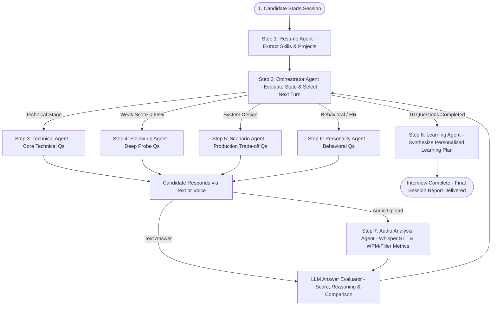

# 🤖 AI Technical Interview Coach

An AI-powered mock interview system built with **FastAPI**, **React**, and **LangGraph**. The platform uses a multi-agent AI framework to parse candidate resumes, generate role-tailored technical and behavioral questions, evaluate spoken or typed answers, and deliver personalized learning plans.

---

## 🌟 Overview

The AI Technical Interview Coach simulates real-world job interviews. Instead of generic questions, the system reads your resume skills and projects to ask grounded, relevant questions. It adapts question difficulty based on your performance, probes deeper when an answer is weak, and provides detailed feedback including score, model answer, speech pace, and filler word breakdown.

---

## 🤖 The 8 AI Agents and Their Roles

The core engine is powered by **LangGraph** with 8 specialized AI agents working together:

| # | Agent Name | File | Role & Responsibility |
|---|---|---|---|
| **1** | **Orchestrator Agent** | [`orchestrator.py`](file:///c:/Users/pande/Interview_Coach/backend/app/agents/orchestrator.py) | **Interview Supervisor & Planner**. Manages state transitions, tracks question limits, and decides which agent should handle the next turn (e.g. Technical, Follow-up, Scenario, or Learning). |
| **2** | **Resume Agent** | [`resume_agent.py`](file:///c:/Users/pande/Interview_Coach/backend/app/agents/resume_agent.py) | **Context Initializer**. Parses PDF/DOCX resumes at session startup, extracting candidate skills, tech stack keywords, and project details so all questions stay grounded in candidate experience. |
| **3** | **Technical Agent** | [`technical_agent.py`](file:///c:/Users/pande/Interview_Coach/backend/app/agents/technical_agent.py) | **Technical Examiner**. Generates role-specific coding, system design, and computer science questions matched to the candidate's target role and resume skills. |
| **4** | **Follow-up Agent** | [`followup_agent.py`](file:///c:/Users/pande/Interview_Coach/backend/app/agents/followup_agent.py) | **Deep Probe Specialist**. Automatically triggered when a candidate's answer score is below 65% or incomplete. Probes deeper into weak technical areas to test true comprehension. |
| **5** | **Scenario Agent** | [`scenario_agent.py`](file:///c:/Users/pande/Interview_Coach/backend/app/agents/scenario_agent.py) | **System Architecture & Situational Specialist**. Asks open-ended production trade-off, architectural design, and practical problem-solving scenarios based on the resume tech stack. |
| **6** | **Personality Agent** | [`personality_agent.py`](file:///c:/Users/pande/Interview_Coach/backend/app/agents/personality_agent.py) | **Behavioral & HR Specialist**. Asks questions about past project challenges, team collaboration, leadership experience, and soft skills. |
| **7** | **Learning Agent** | [`learning_agent.py`](file:///c:/Users/pande/Interview_Coach/backend/app/agents/learning_agent.py) | **Post-Interview Coach**. Runs when the interview completes (max questions reached). Synthesizes candidate scores and resume skill gaps to generate a personalized learning plan. |
| **8** | **Audio Analysis Agent** | [`audio_analysis_agent.py`](file:///c:/Users/pande/Interview_Coach/backend/app/agents/audio_analysis_agent.py) | **Voice & Speech Analyst**. Processes recorded candidate voice responses off the main thread. Measures Speech Pace (WPM), counts filler words (`um`, `uh`, `like`), and computes clarity/confidence scores. |

---

## 🔄 Sequential Multi-Agent Execution Flow

The diagram below shows how candidate interactions move sequentially through each of the 8 agents:


```mermaid
flowchart TD
    Start([1. Candidate Starts Session]) --> Resume[Step 1: Resume Agent - Extract Skills & Projects]
    Resume --> Orch[Step 2: Orchestrator Agent - Evaluate State & Select Next Turn]
    
    Orch -->|Technical Stage| Tech[Step 3: Technical Agent - Core Technical Qs]
    Orch -->|Weak Score < 65%| Followup[Step 4: Follow-up Agent - Deep Probe Qs]
    Orch -->|System Design| Scenario[Step 5: Scenario Agent - Production Trade-off Qs]
    Orch -->|Behavioral / HR| Personality[Step 6: Personality Agent - Behavioral Qs]
    
    Tech & Followup & Scenario & Personality --> CandidateAnswer[Candidate Responds via Text or Voice]
    
    CandidateAnswer -->|Audio Upload| AudioAgent[Step 7: Audio Analysis Agent - Whisper STT & WPM/Filler Metrics]
    CandidateAnswer -->|Text Answer| LLMEval[LLM Answer Evaluator - Score, Reasoning & Comparison]
    
    AudioAgent --> LLMEval
    LLMEval --> Orch
    
    Orch -->|10 Questions Completed| Learning[Step 8: Learning Agent - Synthesize Personalized Learning Plan]
    Learning --> Complete([Interview Complete - Final Session Report Delivered])
```

---

## ⚙️ How Each Agent Communicates & Generates Responses

Below is the step-by-step breakdown of how each agent processes state and communicates with the LLM or AI engines:

### Step 1: Resume Agent (`resume_agent.py`)
- **Trigger**: Executed once when the interview session is created.
- **Input**: Raw text extracted from uploaded PDF/DOCX resumes.
- **LLM Communication**: Sends raw text to the LLM to extract structured candidate skills, tech stack keywords, and project summaries.
- **Output**: Seeds `resume_context` into session state so all future questions reference candidate experience.

---

### Step 2: Orchestrator Agent (`orchestrator.py`)
- **Trigger**: Executed before every single question turn.
- **Input**: Current session state, turn history, question sequence index, and candidate score history.
- **Routing Logic**: Evaluates if `question_count >= 10` or `current_stage == "complete"`. If complete, routes to **Learning Agent**; if previous score `< 65`, routes to **Follow-up Agent**; otherwise routes to **Technical**, **Scenario**, or **Personality** agents based on planned sequence.

---

### Step 3: Technical Agent (`technical_agent.py`)
- **Trigger**: Routed by Orchestrator for technical turns.
- **Input**: Candidate target role, resume skills, subtopic mapping, and conversation history.
- **LLM Communication**: Prompts the LLM to generate a role-relevant technical question matching candidate skills.
- **Output**: Appends new assistant question to conversation history and increments question count.

---

### Step 4: Follow-up Agent (`followup_agent.py`)
- **Trigger**: Routed by Orchestrator when candidate's previous score is low (`< 65/100`).
- **Input**: Previous question text, weak candidate answer, and LLM reasoning evaluation.
- **LLM Communication**: Prompts the LLM to generate a deep-dive follow-up probe targeting the specific weakness.
- **Output**: Updates state with follow-up depth counter and probing question.

---

### Step 5: Scenario Agent (`scenario_agent.py`)
- **Trigger**: Routed by Orchestrator for architectural and system design turns.
- **Input**: Candidate target role, resume tech stack, weak areas, and score history.
- **LLM Communication**: Prompts the LLM to generate an open-ended production scenario question testing architecture trade-offs.
- **Output**: Updates state with scenario stage question.

---

### Step 6: Personality Agent (`personality_agent.py`)
- **Trigger**: Routed by Orchestrator for soft skills and behavioral turns.
- **Input**: Target role, resume project details, and conversation history.
- **LLM Communication**: Prompts the LLM to generate a behavioral fit question focusing on past challenges, teamwork, or leadership.
- **Output**: Updates state with personality question.

---

### Step 7: Audio Analysis Agent (`audio_analysis_agent.py`)
- **Trigger**: Executed off the main thread when candidate uploads a spoken audio response (`.webm`).
- **Engine Processing**:
  - **OpenAI Whisper STT** (`faster-whisper` C++ engine) transcribes spoken audio locally into text.
  - **Audio Analytics Engine** calculates Words Per Minute (WPM) speech pace and counts filler words (`um`, `uh`, `like`, `you know`, `basically`).
- **Output**: Merges transcribed text into candidate answer and passes combined metrics to LLM evaluator.

---

### Step 8: Learning Agent (`learning_agent.py`)
- **Trigger**: Executed when 10 questions are completed.
- **Input**: Session score history, weak areas collected, target role, and resume context.
- **LLM Communication**: Prompts the LLM to analyze performance gaps and synthesize a personalized learning plan.
- **Output**: Returns state updates marking `"current_stage": "complete"` and saving `"learning_plan"` to state for display on the Candidate Session Report page.

---

## 🗣️ Voice Generation (Edge-TTS) & Input Processing

- **Text-to-Speech (Edge-TTS)**: Converts AI questions into high-quality human speech clips (`.mp3`) using personas:
  - `en-US-JennyNeural` (HR/Behavioral)
  - `en-US-ChristopherNeural` (Technical/Follow-up)
  - `en-US-EricNeural` (System Design/Scenario)
  - `gTTS` fallback engine activates automatically if Edge-TTS requests fail.

- **Candidate Input**:
  - **Typed Text**: Evaluated directly by LLM scoring rubrics (0-100 score, reasoning, model answer, comparison).
  - **Spoken Audio**: Transcribed locally via OpenAI Whisper STT (`faster-whisper`), evaluated for speech pace and filler words, then scored by LLM.

---

## 🛠️ Technology Stack

- **Backend**: Python 3.11, FastAPI, LangGraph, OpenAI / Gemini LLM API, OpenAI Whisper STT (`faster-whisper`), Edge-TTS (TTS), OpenCV & MediaPipe (Computer Vision).
- **Frontend**: React 19, Vite, TypeScript, Tailwind CSS v4, Zustand (State Management), TanStack React Query, Recharts (Analytics Charts).
- **Data & Storage**: In-Memory Transient Store (`app/store.py`), zero database installation required.

---

## 🚀 Quick Start Guide

### Prerequisites
- Python 3.11
- Node.js 18+

### 1. Setup & Run Backend

```bash
cd backend

# Create & activate environment
conda create -n ai-interview python=3.11 -y
conda activate ai-interview

# Install dependencies
pip install -r requirements.txt

# Create .env file
cp .env.example .env

# Run FastAPI Server
uvicorn app.main:app --reload --host 0.0.0.0 --port 8000
```

FastAPI Server runs at: `http://localhost:8000` (API Docs at `http://localhost:8000/docs`).

### 2. Setup & Run Frontend

In a new terminal window:

```bash
cd frontend

# Install dependencies
npm install

# Create .env file
cp .env.example .env

# Run Vite Dev Server
npm run dev
```

Frontend Application runs at: `http://localhost:5173`.

---

## 🧪 Testing

Run backend tests:
```bash
cd backend
conda activate ai-interview
pytest
```
